<style>
    body {
        font-family: "Noto Serif JP" !important;
        position: relative;
    }

    @media print {
        @page {
            size: A4;
            margin: 2cm;
        }
        body {
            font-size: 14pt;
        }
    }

    h1, h2, h3, h4 {
        font-family: "Noto Sans JP" !important; 
    }

    h2, h3 {
        font-size: 1.5rem !important;
    }

    table {
        font-family: "Noto Sans JP" !important; 
        font-size: 0.8rem;
        /* max-width: 90%; */
    }

    table th {
        background: #ddd;
    }
    img {
        border: 1px solid #ddd;
    }
    div.noborder img {
        border: none;
    }
</style>
<div style="justify-items: center;">

# 日本産科婦人科内視鏡学会
# 症例/合併症登録システム
# JOE-D 5 version 2.0 取扱説明書

</div>

<div style="position: fixed; right: 3cm; top: 30cm;">
© 2025 P4mohnet - document v4.0 - 2025-12-12<br/>
© 2026 P4mohnet - document v4.1 - 2026-01-08<br/>
</div>

<div style="page-break-after: always"></div>

## 1. 取扱説明書について

日本産科婦人科内視鏡学会症例登録入力システム JOE-D 5の取り扱いについての説明書です。

> 本説明書中の画面イメージに表示されている情報は、生成AIで作成したモックアップで、現実の臨床情報に基づいた仮名加工情報ではありません。

## 2. 動作環境

日本産科婦人科内視鏡学会症例登録入力システムが動作するには以下の環境が必要です。  

アプリケーションをインストールした端末上にデーターが保存されます。
USBメモリなどにアプリケーションをインストールしても他の端末にデーターを移動することはできませんのでご注意ください。

【Windows】
> Window11以降のWindowsが動作するメインメモリ8GBytes以上を推奨。
> インストールにはディスクに200MBytes以上の空き容量が必要。
>
> Windows10 64ビット版でも動作を確認していますが、Windows10のサポートが2025年10月14日で終了しているため公式の動作対象からは外させていただきます。

【MacOS】
> MacOS11.15(BigSur)以上が動作しているmac。
>インストールにはディスクに500MBytes以上の空き容量が必要。
>
> MacOSのバージョンによっては一部のキーボードショートカットがOS標準の機能と衝突するため使用出来ません。

以下文章中でのMacOSでの操作説明で現れる、⌃はcontrolキー、⇧はシフトキー、⌥はoptionキー、⌘はcommandキー、⇥はタブキー、↩はリターンキーを示します。

## 3. インストール方法
### 3.1. Windows
1. 配布されているインストーラーをダウンロードします。

最新ビルドの配布は開発リポジトリのリリース( [https://github.com/piyotaicho/JOED/releases/](https://github.com/piyotaicho/JOED/releases/) )で行っております。

2. ダウンロードしたインストーラーを実行します。
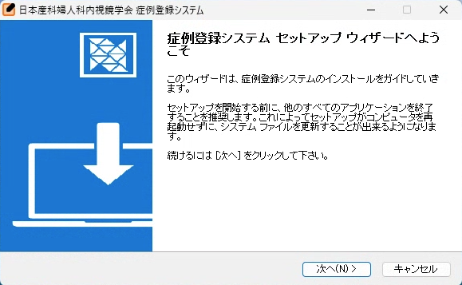

インストーラーは、標準設定でのインストールをお薦めします。

> Windowsでは、バージョンやセキュリティソフトなどの設定により、ダウンロードからインストール、実行のそれぞれの段階で多様なセキュリティ警告が表示されます。
> 代表的なセキュリティ警告への対応については 付記1 を参照してください。

3. アプリケーションを起動する。

アプリケーションは、インストーラーを実行したユーザーのみを対象としてインストールされます。スタートメニューの「日本産科婦人科内視鏡学会」フォルダー内に「症例登録システム」として表示されます。

### 3.2. MacOS
1. 配布されているディスクイメージをダウンロードします。

最新ビルドの配布は開発リポジトリのリリースで行っております。
[](https://github.com/piyotaicho/JOED/releases/)

2. ダウンロードしたディスクイメージを開いてマウントします。

3. 配布イメージのフォルダーからアプリケーションフォルダーにコピーします。
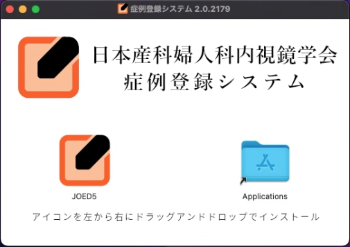

ディスクイメージのフォルダーが開いたら、JOED5アプリケーションのアイコンをフォルダー内のアプリケーションフォルダーへのショートカットへドラッグ＆ドロップしてアプリケーションをインストールします。

バージョンアップで、上書きインストールを行う際は、操作の確認ダイアログが表示されますので、必ず『置き換える』を選択してください。
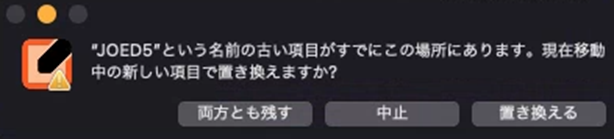

インストールが終了したら、ディスクイメージのフォルダーをゴミ箱にドラッグ＆ドロップしてマウントを解除してください。

4. アプリケーションを起動する。

アプリケーションは、アプリケーションフォルダーを開いて起動するか、ダッシュボードから起動できます。お好みでドックに追加してください。

初回にダウンロードしてインストールしたアプリケーションである旨の確認が表示されます。『開く』を選択してアプリケーションを起動して下さい。

## 4. アンインストール
### 4.1. Windows

アンインストーラーが、スタートメニューの「日本産科婦人科内視鏡学会」フォルダーの中にあります。アプリケーションを終了してから、アンインストーラを実行してください。

アンインストーラーはインストールされたアプリケーションのみを削除し、設定やデーターファイルはそのままPCに残ります。
データーの消去については 付記5 を参照してください。

### 4.2. MacOS

アプリケーションを```⌘ + Q```で完全に終了し、アプリケーションフォルダーからJOED5アプリのアイコンを削除（ゴミ箱にドラッグ＆ドロップ）してください。

この操作ではインストールされたアプリケーションのみが削除され、設定やデーターファイルはそのまま残ります。
データーの消去については 付記5 を参照してください。

<div style="page-break-after: always;"></div>

## 5. 操作説明
### 5.1. 画面の構成

ウインドウとメニュー、スクロールバーから画面は構成されます。ウインドウの大きさは縦方向には変更できますが、横方向には固定となっています。WindowsとMacOSではメニュー構成が若干異なります。

操作の状態によって使用できないメニュー項目はグレーアウトされます。

- Windows

|ファイル |ヘルプ |
|:--|:--|
|新規症例の登録 | JOED5について |
|症例の削除 |
|--- |
|データーの読み込み |
|データーの書き出し |
|--- |
|設定 |
|リスト表示の設定 |
|終了 |

- MacOS

|JOED5 |ファイル |編集 |
|:--|:--|:--|
|JOED5について |新規症例の登録 |取り消す |
|--- |症例の削除 |やり直す |
|設定 |--- |--- |
|--- |データーの読み込み |カット |
|サービス |データーの書き出し |コピー |
|--- |--- |ペースト |
|JOED5を隠す |リスト表示の設定 |全てを選択 |
|他を隠す | | |
|全てを表示 | | |
|--- | | |
|終了 | | |

<div style="page-break-after: always;"></div>

### 5.2. ログイン画面

アプリケーションを起動するとパスワード認証画面が表示されます。

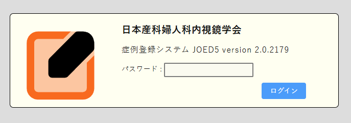

初回インストール後などパスワード認証の設定をしていない場合は、パスワードの入力は不要で、ログインボタンを押すと基本画面に移行します。

パスワードの認証設定は、5.7.2.パスワード認証の設定 を参照してください。

### 5.3. 基本画面
#### 5.3.1 メッセージ

最初にメッセージダイアログが表示されます。

次回起動時以降このメッセージを非表示としたい場合は、チェックボックスを解除してメッセージを閉じてください。このメッセージの表示・非表示は設定の項で変更できます。

#### 5.3.2 症例リスト画面

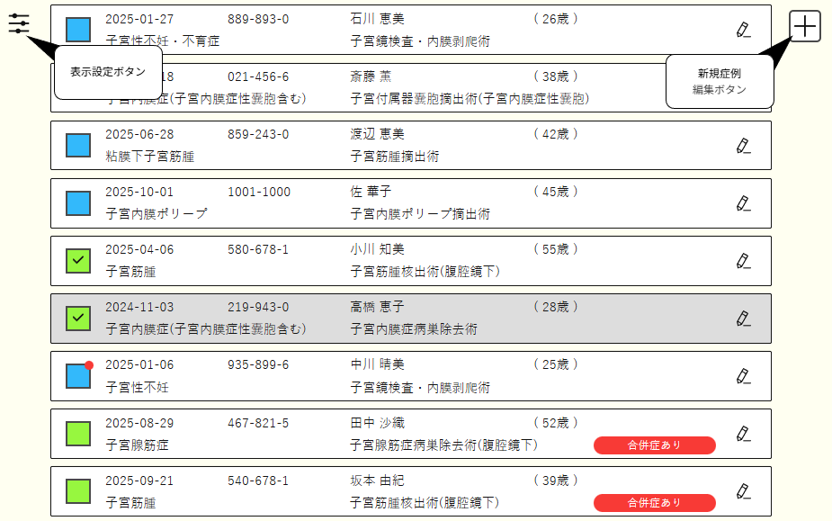

症例リスト画面では、登録されている実施手術の一覧が表示されます。  
表示条件の設定は、メニューの ```リスト表示の設定``` か、画面左上の表示設定ボタンから変更できます。

#### 5.3.3. 症例ブロック

症例ブロックには、患者情報と、手術の主たる診断、主たる実施手術の情報などが表示されます。また、登録拒否が設定された症例は、ID部分が赤文字で表示されます。

アイコンで、症例のカテゴリーとエラーなどの情報の有無が表示されます。

|アイコン |カテゴリー |
|:--:|:--|
|<div style="height: 1.2rem; width: 1.2rem; border: 1px solid #4a4a4a; background: #8cf700; margin: auto;"></div>|腹腔鏡手術 |
|<div style="height: 1.2rem; width: 1.2rem; border: 1px solid #4a4a4a; background: #00f063; margin: auto;"></div>|ロボット支援下手術 |
|<div style="box-sizing: border-box; margin-left: 0.2rem; margin-top: 0.2rem; height: 1rem; width: 1rem; border-top: 0.5rem solid transparent; border-left: 0.5rem solid transparent; border-right: 0.5rem solid #4a4a4a; border-bottom: 0.5rem solid #4a4a4a; background: transparent; margin: auto;"></div>|悪性手術 |
|<div style="height: 1.2rem; width: 1.2rem; border: 1px solid #4a4a4a; background: #00bbff; margin: auto;"></div>|子宮鏡手術 |
|<div style="height: 1.2rem; width: 1.2rem; border: 1px solid #4a4a4a; background: #ffd000; margin: auto;"></div>|卵管鏡手術 |
|<div style="height: 1.2rem; width: 1.2rem; border: 1px solid #4a4a4a; background: #ddd; margin: auto;"></div>|カテゴリー未指定 |
|<div style="margin: auto; height: 0.6rem; width: 0.6rem; border: none; border-radius: 50%; background: #FF3030; transform: translate(0.3rem, -0.3rem);"></div>|情報あり |
|✔|複数選択モードで選択中 |

#### 5.3.4. 症例リスト画面での操作

症例リスト画面では、メニュー以外に以下の操作が可能です。

|Windows |MacOS |動作 |
|:-- |:-- |:-- |
|> |右上の症例追加ボタンをクリック |新規レコードを編集 |
|> |左上の表示設定ボタンをクリック |表示設定を開く |
|> |症例ブロックをクリック |レコードを１つ選択 |
|> |症例ブロックをダブルクリック |レコードを編集 |
|> |症例ブロックのペンアイコンをクリック |レコードを編集 |
|症例ブロックをCtrl + クリック |症例ブロックを ⌘ + クリック |レコードの複数選択 |
|Esc |esc |複数選択モードを解除 |
|Ctrl + N |⌘ + N |新規レコードを編集 |
|K, ↑, Shift + Tab |K, ↑, ⇧ + ⇥ |１つ前(上)の症例を選択 |
|J, ↓, Tab |J, ↓, ⇥ |１つ後(下)の症例を選択 |
|O, Enter |O, ↩ |ブロックを編集 |
|> |スペース |複数選択モード |
|Ctrl + X |⌘ + X |選択されているレコードを削除 |

<div style="page-break-after: always;"></div>

#### 5.3.4. 表示設定

メニューの ```リスト表示の設定``` か、画面左上の表示設定ボタンから表示設定が開きます。
表示設定では、症例リスト画面に表示する症例の順番や絞り込みの設定ができます。

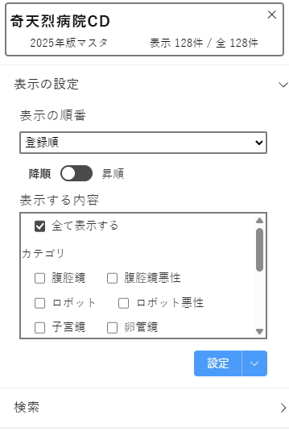

表示設定の最上段のダッシュボードには、施設名、マスタの年次、表示されている症例数、データーベース内に登録された全レコード数が表示されます。

##### 5.3.4.1. 表示の設定

表示のソートを行う対象項目と、昇順と降順の設定のほか、リストに表示するための抽出条件を設定できます。
表示設定が保存された規定の状態から変更されている場合、表示の設定の右側に表示がつきます。

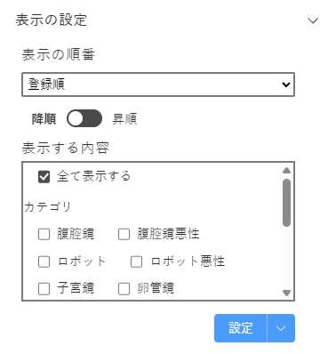

表示条件は、設定ボタン右のオプションメニューボタンから規定の設定に戻すことができます。また、表示の設定は、アプリケーションの再起動ごとに規定の設定に初期化されます。設定ボタン右のオプションメニューボタンから、現在の設定内容を規定として保存できます。
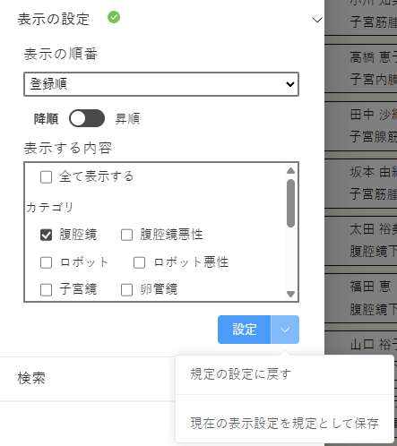

<div style="page-break-after: always;"></div>

##### 5.3.4.2. 検索

レコードの各項目に対して検索が可能です。
検索が実行されている場合、検索の右側に表示がつきます。検索の解除ボタンで検索は解除できます。
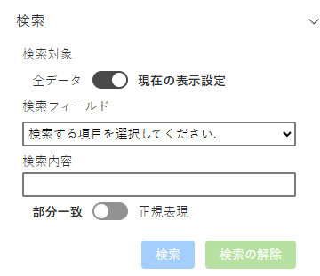

表示の設定とあわせて検索を適応するか、表示の設定を無視してすべてのデーターを対象とするかが選択出来ます。

問合せレコード識別子、患者ID以外を対象とした検索では、部分一致もしくは正規表現を用いた柔軟な検索式を構築できます。
患者IDで検索する場合は```,```で区切って複数の対象を指定できます。また、患者IDに用いられている```-```などの文字は無視して数字だけで検索が可能です。

問い合わせレコード識別子、患者ID、患者名以外の項目を対象とした場合、２つまでの検索を同時に行うことでより細かい抽出条件を設定できます。

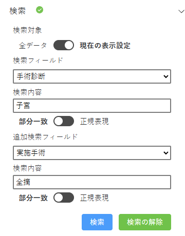

<div style="page-break-after: always;"></div>

### 5.4. 編集画面

新規症例編集ボタンもしくは、各ブロックにある編集ボタンからデーターの編集画面に遷移します。

<div class="noborder">


</div>

画面の上から基本情報セクション、手術診断セクション、実施手術セクション、合併症セクション、メモセクションの入力部分となっています。
操作ボタンは基本情報セクションに左右の移動ボタン、最下段にメモ開閉ボタン、情報ボタン、リスト画面に戻るボタン、情報保存ボタン、オプションメニューボタン、データー削除ボタンが用意されています。

この画面では以下の操作が可能です。

|Windows |MacOS |動作 |
|:-- |:-- |:-- |
|>|左移動ボタン|リスト表示で前(上)に表示されていたデーターに移動
|>|右移動ボタン|リスト表示で次(下)に表示されていたデーターに移動
|Shift + 左移動ボタン|⇧ + 左移動ボタン|編集内容を保存してリスト表示で前(上)に表示されていたデーターに移動
|Shift + 右移動ボタン|⇧ + 右移動ボタン|編集内容を保存してリスト表示で次(下)に表示されていたデーターに移動
|>|各セクションの 追加ボタン をクリック|各セクションの項目を新規追加
|>|各セクションの項目の 編集ボタン をクリック|項目を編集
|>|各セクションの項目の ハンドル をドラッグ＆ドロップ|項目の順番を変更
|Ctrl + 0|⌘ + 0|手術日の入力項目に移動
|Ctrl + 1|⌘ + 1|手術診断の新規追加
7|Ctrl + 2|⌘ + 2|実施手術の新規追加
|Shift + Ctrl + 2|⇧ ⌘ + 2|実施手術セクションのアプローチ入力ボタンに移動
|Ctrl + 3|⌘ + 3|合併症の新規追加
|Shift + Ctrl + 3|⇧ ⌘ + 3|合併症無しボタンに移動
|>|各セクションの項目の 削除ボタン をクリック|選択中の各セクションの項目を削除
|Backspace, Delete|Delete |^
||||
|>|メモ開閉ボタン をクリック|メモの入力欄を開閉する
|>|情報ボタン をクリック|システムのチェック機構からデーターについて修正などの情報があれば表示する
|>|戻るボタンをクリック|症例リスト画面に戻る
|Ctrl + U|⌘ + U|^
|>|編集内容を保存ボタンをクリック|編集内容を保存して症例リスト画面に戻る
|Ctrl + Enter|⌘ + ↩|^
|Shift + 編集内容を保存ボタンをクリック|⇧ + 編集内容を保存ボタンをクリック|編集内容を一時保存して症例リスト画面に戻る
|>|削除ボタンをクリック|編集中のデーターを削除
|Ctrl + X|⌘ + X|^
|>|オプションメニューボタンから 保存して次へ をクリック|編集内容を保存してリスト表示で次(下)に表示されていたデーターに移動
|>|オプションメニューボタンから 保存して前へ をクリック|編集内容を保存してリスト表示で次(下)に表示されていたデーターに移動
|>|オプションメニューボタンから 保存して新規作成 をクリック|編集内容を保存して新規のデーターを作成
|>|オプションメニューボタンから 一時保存して新規作成 をクリック|編集内容を一時保存して新規のデーターを作成

<div style="page-break-after: always;"></div>

#### 5.4.1. 基本情報セクションの入力
##### 5.4.1.1. 手術日
半角数字で 2025-06-07 のように入力するか、入力ボックスをクリックして表示されるカレンダーから手術日を入力します。  
提出データに手術日は情報として含まれませんが、入力マスタの選択と重複入力の回避のため、一時保存でも必須入力項目です。

##### 5.4.1.2. 患者ID
患者IDを入力します。
余計な空白文字は削除され、全角文字で英数字を入力しても半角文字に置換されます。

重複入力確認のため、同一の手術日に同一の患者IDの手術実施登録はできません。同日に同じ患者に別の手術を行った場合は、患者IDに(1)などの添え字を加えて登録してください。

患者IDは提出データには情報として含まれませんが、重複入力確認のため一時保存でも必須入力項目です。

##### 5.4.1.3. 補足情報
患者IDの脇に表示されている情報アイコンをクリックすると補足情報の入力画面が開きます。

登録拒否を表明された患者様の情報については、登録拒否を選択することができます。
登録拒否を選択すると、レコード識別子が表示されます。この文字列は既に学会に情報を提出した後に、患者様からの申し出により情報利用の停止を申請する際にご利用いただくものです。  
学会に情報提出後の、具体的な手続きは学会事務局までお問い合わせください。


日産婦腫瘍登録番号とNCD症例識別コードは現在入力を推奨してはおりません。
ソフトウエアの設定で入力を許可した場合、もしくは過去に入力がある場合のみ編集可能な状態で表示されます。

##### 5.4.1.4. 患者名
必須入力項目ではありません。

##### 5.4.1.5. 年齢
必須入力項目ではありません。
1～120の数値が入力出来ます。全角文字は自動的に半角文字に置換されます。

##### 5.4.1.6. 手術時間
手術時間を選択肢から入力します。
また、選択肢を展開せず直接数値を入力することで、該当する選択肢が自動的に選択されます。時間の入力は、数値で 分 もしくは 時:分 と入力することで自動的に解析され適切な選択肢が選択されます。
 
この項目は登録の必須項目です。

<div style="page-break-after: always;"></div>

#### 5.4.2. 手術診断セクションの入力
手術診断は、手術後の病理診断などに基づいた最終診断を主たる診断として入力してください。一番上に表示されている項目が主たる診断となります、必要に応じて順序を変更してください。
その他、術中所見に基づく診断も追加して入力ができます。

この項目は登録の必須項目です。

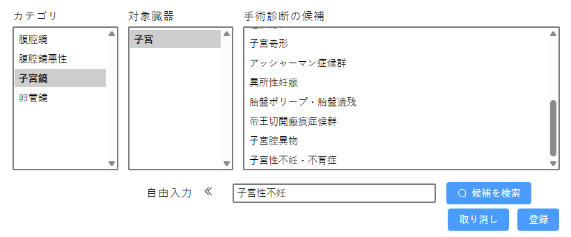

入力は、手術カテゴリ、対象臓器、候補病名の選択肢から順に選択して登録します。

自由入力の部分をクリックすると、自由入力欄が使用可能となり、自由入力の内容に近い表現の候補を表示します(ICD10コードでも検索できます)。

登録の際の匿名加工にあたり、内容のカテゴライズが求められるので自由入力での手術診断の確定は可能な限り控えてください。
提出データーに含まれる自由入力の使用が多いと判断した場合、データーの修正再提出を依頼させていただくことがあります。

<div style="page-break-after: always;"></div>

#### 5.4.3. 実施手術セクションの入力
実施手術は、実施手術内容のうち中心となる術式を主たる実施手術として入力してください。一番上に表示されている項目が主たる実施手術となります、必要に応じて順序を変更してください。
その他、可能な限り実施した手術内容に該当する内容を入力してください。

この項目は登録の必須項目です。

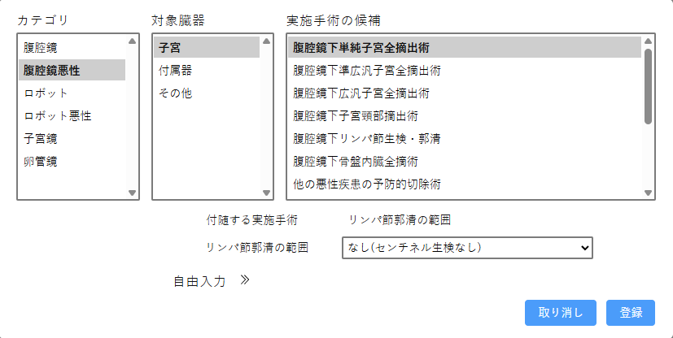

入力は、手術カテゴリ、対象臓器、候補病名の選択肢から順に選択して登録します。
候補病名の内容に応じて、追加情報の入力が求められます。

自由入力の部分をクリックすると、自由入力欄が使用可能となり、自由入力の内容に近い表現の候補を表示します(ICD10コードでも検索できます)。

登録の際の匿名加工にあたり、内容のカテゴライズが求められるので自由入力での手術診断の確定は可能な限り控えてください。
提出データーに含まれる自由入力の使用が多いと判断した場合、データーの修正再提出を依頼させていただくことがあります。

上記項目の登録後、腹腔鏡手術、ロボット支援下手術、子宮鏡手術では、アプローチ法・使用器材の入力を行います。
アプローチ法の入力では、基本的な必須入力部分と追加調査部分があります。必須入力部分は、必須入力部分のうち1項目だけが選択出来ます。

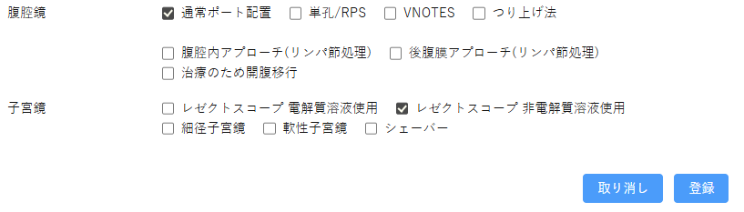
> 腹腔鏡手術、ロボット支援下手術で、腹腔内所見により治療完遂のために開腹手術、腹腔鏡手術へのコンバージョンが生じた際には、このアプローチ法入力で開腹移行、腹腔鏡移行を選択してください。

> 施設によって、標準的なアプローチ法や使用器材が固定されていることに備えて、5.7.3.画面表示・入力の設定 で基本的な選択を事前に設定することができます。

<div style="page-break-after: always;"></div>

#### 5.4.4. 合併症セクションの入力
合併症は術中、術後大旨1ヶ月から半年程度の標準的な術後管理の期間中に発生した手術に関わる合併症を入力します。
この項目は登録の必須項目です。

合併症が認められなかった場合は、合併症なしのチェックを行います。
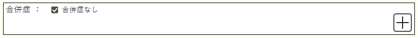

合併症入力は、合併症の分類を選択すると必要な入力項目と選択肢が表示されます。また、合併症の程度を選択すると、合併症の転帰についても必要な選択肢が表示されます。
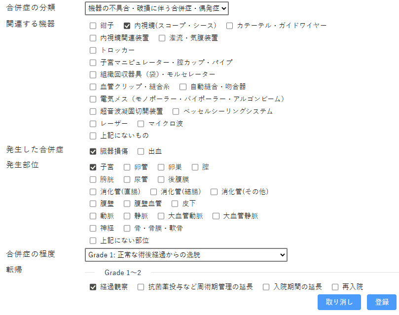

入力した合併症の内容はセクションの項目部分にマウスカーソルをあわせると表示されます。
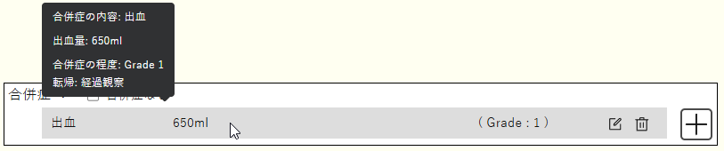

<div style="page-break-after: always;"></div>

### 5.5. データーの書き出し
データーベースに登録された内容をファイルに出力します。

出力の形式は、学会の登録に提出する様式のデーターファイル、データーベースの内部利用形式に近いバックアップデーターファイル、リストに表示されている項目のCSVファイルの3種類が選択出来ます。

それぞれの出力は、出力先を指定してファイルに保存ができます。
バックアップデーターファイルとCSVファイルには個人を特定しうる情報が含まれますので、出力後のデーターの取扱には特に注意を払っていただく必要があります。

#### 5.5.1. 学会提出用のデーターファイルの作成
出力年次を選択してデーターのチェックと、提出に不要な情報を削除したデーターファイルを作成します。

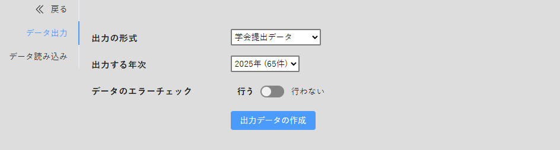

入力内容に修正が必要な場合は、各データーに問題の情報を書き込みます。各データーには情報ありマークがついて表示されますので、編集画面で確認してください。

### 5.6. データーの読み込み
2019年登録まで使用した JOE-D version 4 のデータベース仕様形式に沿って出力されたmergeファイル(.mer)、その他ソフトウエアからリストとして出力されたカンマ区切りのファイル(.csv)やFilemakerのmergeファイル(.mer)、JOE-D 5のバックアップとして書き出されたファイル(.json)を読み込むことができます。
JOE-D 5のバックアップデーター形式のファイルを読み込むことで複数の端末で入力した情報を一台の端末に纏めることができます。
また、婦人科悪性腫瘍総合入力システム(JESGO)から、JOE-D 5の形式で書き出された.jsonファイルも利用できます。

#### 5.6.1. JOE-D 5バックアップデーター形式の(.json)ファイルの読み込み
ファイルの指定 ボタンで.jsonファイルを指定し、ファイルの読み込みと変換 ボタンでファイルの内容を確認します。

表示されたレコードの数などを確認して、変換したデータの登録 ボタンを押してデータベースに保存してください。
重複と判断されたレコードは登録されません。

バックアップデーター形式のファイルを利用することで、複数の端末で分散して入力していても、提出データーを作成する1台の端末で読み込むことで情報を纏めることができます。

##### 5.6.2. ExcelやFilemakerなどから出力されたCSVファイルの読み込み
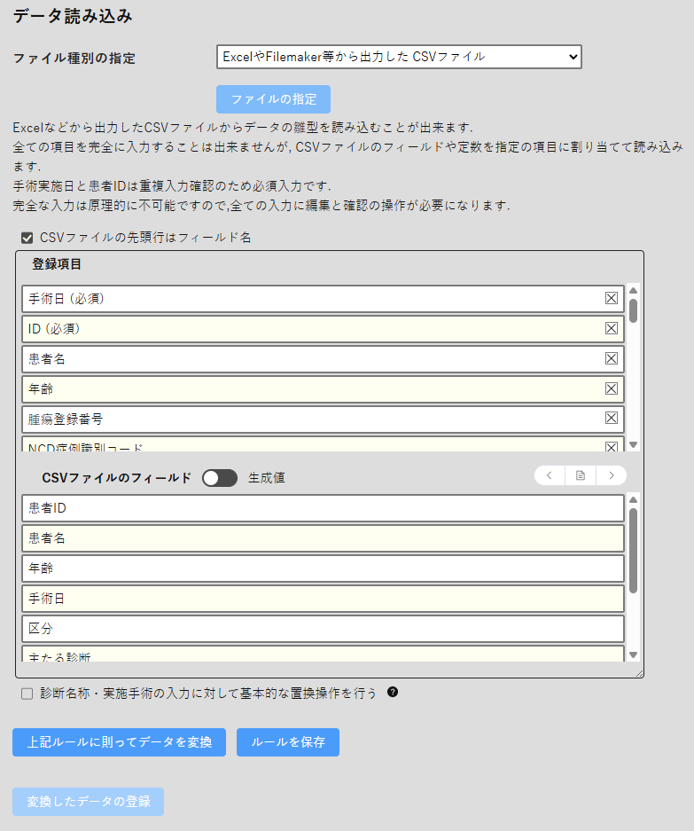

ファイルの指定 ボタンで、読み込みたいデータを含んだ.csvもしくは.merファイルを指定します。
CSVファイルからの読み込みは、データの変換を伴いますので読み込んだデーターの確認と修正保存が必須となります。また、合併症については様式が大幅に異なるため、合併症の有無以外の情報は設定できません。

ファイルを読み込むと、ファイルの内容が解析されてフィールド割り当てのツールが開きます。
CSVファイルの先頭行に列の名前が記録されている場合は、```CSVファイルの先頭行はフィールド名``` をチェックしてください。
先頭行からデータが記録されている場合は、チェックを外してください。チェックを外すとExcelの列名と同じ表現様式(A-ZAA-AZ...)で割り当てに使用する列名を表示します。

フィールド割り当てのツールでは、上段にデータベースの登録項目、下段に読み込んだCSVファイルのフィールドや、生成値が表示されます。

下段に表示されたCSVファイルのフィールドを、ドラッグ＆ドロップで上段の登録項目フィールドに割り当ててゆき、登録ルールを作成します。
下段の上にあるスイッチで、下段をCSVファイルのフィールド選択と生成値の選択に切り替えることができます。

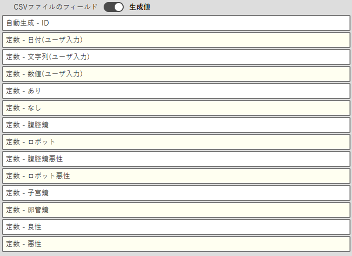

CSVファイルのフィールドと表示された部分の右側にある、操作ボタンをクリックすることでCSVファイルの行を送って内容を参照することができます。また、中央のボタンをクリックすることでフィールド名の表示に戻ることができます。

JOE-D version 4に準じた内容の場合、手術診断や実施手術の置き換えが多数発生します。必要な基本的な情報の置換操作を行う際は、画面下方のチェックボックスをチェックしてください。

作成した登録ルールは、ルールを保存 ボタンでシステムに保存しておくことができます。同じルールのファイルを繰り返し読み込むときに再度ルールを作成する手間が省けます。

変換されたレコードの数などを確認して、変換したデータの登録 ボタンをクリックして登録を行います。この作業には若干時間が掛かります。

<div style="page-break-after: always;"></div>

### 5.7. 設定
#### 5.7.1. 施設情報の設定
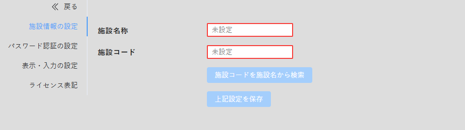
登録用データーファイルの作成には施設情報の設定が必須です。

これまで登録して頂いたことのある施設は、施設名称を部分一致で検索して、施設名称、施設コードを選択して入力することが出来ます。
施設コードは、学会ホームページの会員用サイトにある、会員登録情報に記載されております。異動後や、新規施設で不明という場合は学会事務局までお問い合わせください。

入力が完了したら 上記設定を保存 ボタンで設定を保存してください。

#### 5.7.2. パスワード認証の設定
起動時のパスワード認証の要否および、パスワードの設定ができます。

設定を変更した場合は、設定内容を確認して 上記設定を保存 ボタンで設定を保存してください。

> パスワードを紛失された場合、全てのデーターを含めて回復不能となることがありますので十分にご注意ください。

#### 5.7.3. 画面表示・入力の設定
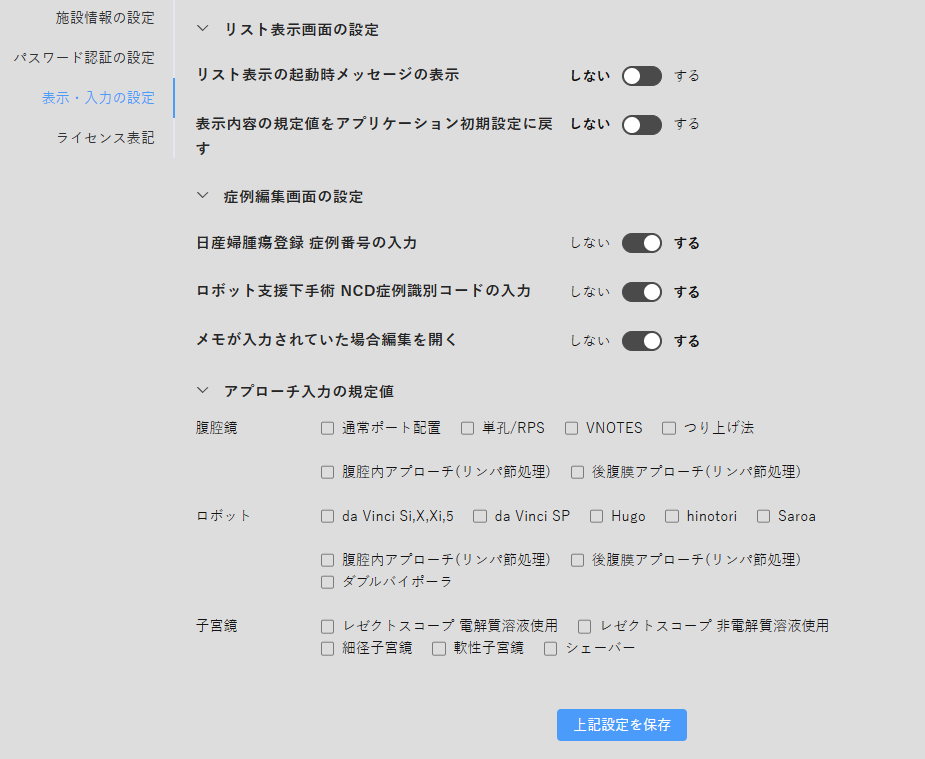

症例リスト画面と症例編集画面の設定、アプローチ法の初期入力値の設定ができます。

入力が完了したら 上記設定を保存 ボタンで設定を保存してください。

<div style="page-break-after: always;"></div>

## 6. 付記
### 6.1. 付記1 Windowsで表示されるセキュリティ警告について

Windowsではダウンロードしたプログラムの実行に関して多重の制限が掛かっています。
OSのバージョン、使用しているブラウザなど環境によりエラーの様式が大幅に異なるため一概にご案内が困難です。また施設によってはセキュリティソフトウエアの制限も掛かっていることがありますので、施設の担当者にも御確認ください。

この件については各PCメーカーからの案内が比較的まとまっておりますので、一例として富士通のQ&Aをご紹介させていただきます。

1. ダウンロードをしてもブラウザにメッセージが表示されて保存できない

https://www.fmworld.net/cs/azbyclub/qanavi/jsp/qacontents.jsp?PID=0911-2449

2. 実行しようとすると「WindowsによってPCが保護されました」と表示される

https://www.fmworld.net/cs/azbyclub/qanavi/jsp/qacontents.jsp?PID=0209-8188

<div style="page-break-after: always;"></div>

### 6.2. 付記2 検索で利用できる正規表現

正規表現は、文字列のパターンを表現するための特殊な記法です。JOED5の検索機能では、以下の正規表現が利用できます。

|正規表現|意味|
|:--|:--|
|x |xという文字
|xyz|x, y, zがこの順番で出現する場合にマッチ
|[xyz]|"x, y, zのいずれか1文字にマッチ
|[x-z]|x～zまでのいずれか1文字にマッチ
|[^x-z]|x, y, zのいずれでもない任意の1文字にマッチ
|.|任意の1文字（改行などを除く）
|(abc)|abcをグループ化し、キャプチャ（後方参照）の対象とする
|(?:abc)|abcをグループ化するが、キャプチャの対象としない
|abc\|xyz|abc または xyzにマッチ
|^x|xで始まる文字列にマッチ
|x$|xで終わる文字列にマッチ
|x*|0文字以上のxにマッチ（最大マッチング）
|x+|1文字以上のxにマッチ（最大マッチング）
|x?|0文字または1文字のxにマッチ（最大マッチング）
|x{n}|n個のxにマッチ
|x{n,}|n個以上のxにマッチ
|x{n,m}|n個～m個のxにマッチ（最大マッチング）
|x*?|0文字以上のxにマッチ（最少マッチング）
|x+?|1文字以上のxにマッチ（最少マッチング）
|x??|0文字または1文字のxにマッチ（最少マッチング）
|x{n}?|n個のxにマッチ（最少マッチング）
|x{n,m}?|n個～m個のxにマッチ（最少マッチング）
|(?:=x)|xという文字列が後に続く場合に、xにマッチ（先読み）
|(?:!x)|xという文字列が後に続かない場合に、xにマッチ（否定先読み）
|(?<=x)|xという文字列が前に現れる場合に、yにマッチ（後読み）
|(?<!x)|xという文字列が前に現れない場合に、yにマッチ（否定後読み）
|\1 \2|n番目のキャプチャグループ（(...)）でマッチした内容

<div style="page-break-after: always;"></div>

### 6.3. 付記3 JOE-D version 4のmergeファイルを読み込む設定
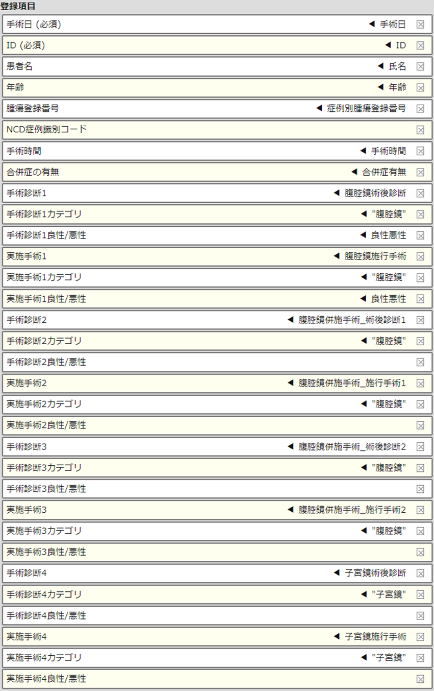

<div style="page-break-after: always;"></div>

### 6.4. 付記4 データーベースの保存場所
データベースに登録された情報は、実行されているPCのユーザデータフォルダに保存されています。情報の保存フォルダを開くには以下の操作を行ってください。

フォルダ内の、joed.nedbがデータファイル、config.jsonがアプリケーションの設定ファイルとなります。
PCの更新などで、別のPCへのデータ移行は、新規インストールしたPCの同一フォルダにこれら２つのファイルをコピーすることで環境の移行が可能です。

> JOE-D 5 Version 2.0 からは 設定の制限を解除することでアプリケーション上でバックアップファイルを作成できます。

#### 6.4.1.	Windows
Windowsキー + Rを押し、コマンド実行ダイアログを表示します。
表示された入力ダイアログに ```%appdata%\JOED5``` を入力して OK をクリックしてフォルダが開きます。

#### 6.4.2.	MacOS
Finder で ```⇧ + ⌘ + G``` でフォルダへ移動のダイアログを表示します。
そこに ```~/Library/Application Support/JOED5/``` を入力してフォルダの表示を移動します。

### 6.5. 付記5 アプリケーション情報の完全削除
Windowsではアンインストールの際、アンインストール手順の最後に削除の確認チェックボックスが表示されます。

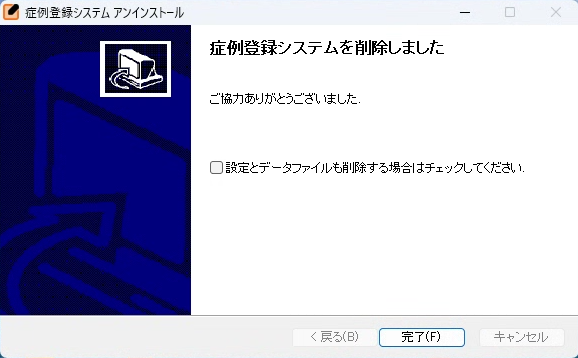

このチェックボックスをチェックしてアンインストールを終了すると情報の完全削除が可能です。

MacOSにはこのような機能がありません。MacOSでは 付記4で示したデータフォルダを削除することで情報を完全に削除可能です。

JOED5アプリケーションを ```⌘ + Q``` で終了させたのち、Finder で ```⇧ + ⌘ + G``` でフォルダへ移動のダイアログを表示します。
そこに ```~/Library/Application Support/``` を入力してフォルダの表示を移動します。
表示されたフォルダ内にある ```JOED5``` のフォルダを削除することで情報の完全削除が可能です。

> JOE-D 5 Version 2.0 からは 設定の制限を解除することでデーターの完全削除がアプリケーション上で可能になりました。

<div style="page-break-after: always;"></div>

### 6.6. 付記6 アプリケーション情報のバックアップ・削除を行う
設定画面を開き、以下のキーボード操作を行います。
```上矢印 上矢印 下矢印 下矢印 左矢印 右矢印 左矢印 右矢印 B A Enterキー```

操作が認識されると、設定画面の制限が解除されタブに高度な操作タブが表示されます。

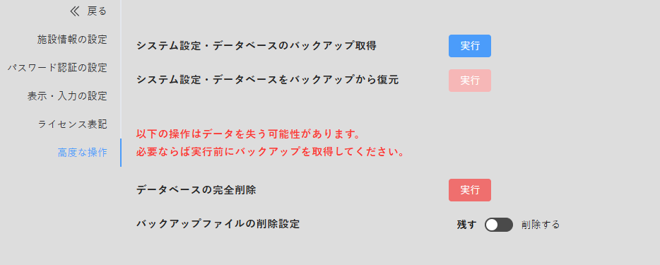

この画面では、設定とデーターをまとめた完全バックアップ専用ファイルの取得、トラブルシューティング用バックアップを含めたデーターの削除、バックアップ専用ファイルからの復元が可能です。
復元は、データーベースを削除後にのみ実行できます。他の端末からデーターを導入する場合は、5.5.データーの書き出し と 5.6.1.データーの読み込み で記載した、JOE D-5バックアップデーター形式で対応してください。

> バックアップデーターには個人を特定しうる情報が含まれておりますので取扱にはご注意ください。

<div style="page-break-after: always;"></div>

### 6.7. 付記7 【Windowsのみ】 データベースファイルを共有フォルダに設置しての利用
Windowsでは(MacOSでも可能ではあるが一般ユーザが設定するには難度が高く推奨できない)手動設定でデータベースファイルを共有フォルダに設置することで、同時に参照/編集はできませんがデータを共用しての利用が可能です。

学会ではこの設定の詳細なサポート及び、設定により生じた不具合に対する対応は承りませんのでご了承ください。

症例登録システムを終了した状態で、付記４で示したデータベースファイルフォルダの中にあるファイル ```joed.nedb``` を共有フォルダである ```\\server\kyouyu\folder``` にコピーします。

スタートメニューのなかの 日本産科婦人科内視鏡学会 > 症例登録システム の項目を右クリックで選択し。表示されたメニューから その他 > ファイルの場所を開く を順に選択して、ショートカットのはいったフォルダを表示します。

フォルダ中の 症例登録システム を右クリックして表示されるメニューから プロパティ を選択し、開いたプロパティダイアログ中の リンク先 の項目を編集します。

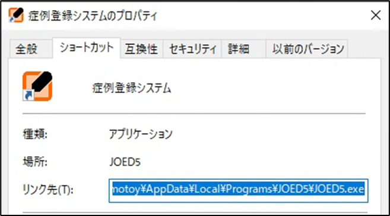

```(文字列)\JOED5\JOED5.exe``` に引き続き、半角スペースを入力し、その後に ```--datadir=”\\server\kyouyu\folder”``` を入力し、OKボタンを押して設定を確定します。

> アプリケーションのインストール先がネットワーク上の共有フォルダの場合 ```JOED5.exe –-no-sandbox``` となっていることがあります。その文字列はそのままにしてください。

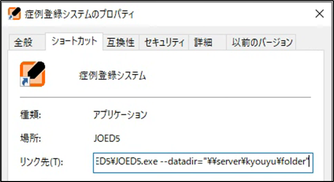

上記の作業で共有フォルダでの作業が可能になります。
データーベースの仕様上、同時使用は1ユーザーまでとなっており、他のユーザーが登録システムを使用している場合には、エラーダイアログが表示され利用はできません。

<div style="page-break-after: always;"></div>

### 6.8. 付記8 データー仕様
#### 6.8.1. 提出データ
JSONでエクスポートされる.

```
[
    { 提出データヘッダ },
    { 症例データ1 },
    { 症例データ2 },
    ...
    { 症例データn }
]
```

#### 6.8.2. オブジェクト:提出データヘッダ
|名称                        |タイプ  |フォーマット規則|解説|
|:--------------------------|:-----:|:---------:|:--|
|InstitutionName            |string |-|施設名|
|InstitutionID              |string |\d{5}|施設コード|
|Timestump                  |integer |-|提出データ作成日時のUNIX timestump|
|Year                       |string |20(19\|[23]\d)|提出データの年次|
|NumberOfCases              |integer|-|登録手術数（サードパーティーからの書き出しに対するエラーチェック用）|
|NumberOfDenial             |integer|-|登録拒否数|
|Version                    |string |-|提出データ作成時のソフトウエアのバージョン|
|Platform                   |string |-|JOEDソフトウエア利用環境を示す文字列|
|hash                       |string |-|症例データ部分だけのハッシュ値|

#### 6.8.3. 症例データーベースオブジェクト:Case
|名称                        | タイプ |フォーマット規則|必須項目|エクスポート対象|解説|
|:--------------------------|:-----:|:--:|:--:|:--:|:--|
|DocumentId                 |integer|-|X|-|連続番号
|hash                       |string |-|x|X|レコードのユニークキーであるPatientIdとDateOfProcedureのハッシュ値(提出データ作成時に算出して付加、保存はされない)
|Name                       |string |-|-|-|患者名
|Age                        |integer|-|-|-|年齢
|PatientId                  |string |-|X|-|施設での患者ID
|JSOGId                     |string |-|-|-|日産婦腫瘍登録番号 **(登録非推奨)** 
|NCDId                      |string |\d{18}-\d{2}-\d{2}-\d{2}|-|-|NCD症例識別コード～ロボット登録にけるNCD側の患者番号 **(登録非推奨)** 
|Denial                     |boolean|-|-|-|登録拒否表明フラグ
|DateOfProcedure            |string |20(19\|[23][0-9])-(0[1-9]\|1[012])-([0-2][0-9]\|3[01])|X|-|手術日
|ProcedureTime              |string |-|X|X|手術時間表記テーブルから引用される
|TypeOfProcedure            |string |(腹腔鏡\|腹腔鏡悪性\|ロボット\|ロボット悪性\|子宮鏡\|卵管鏡)|X|X|主たる診断の最初のカテゴリが採用される
|PresentAE                  |boolean|-|X|X|合併症の登録があればtrue
|Diagnoses                  |array  |Diagnosis|X|X|診断オブジェクト
|Procedures                 |array  |Procedure|X|X|術式オブジェクト
|Approach                   |object |Approach|X|X|アプローチ法オブジェクト
|AEs                        |array  |AE|-|X|合併症オブジェクト
|Imported                   |boolean|-|-|-|読み込まれたデータで欠損などが明らかなもの
|Notification               |string |-|-|-|データチェックによる確認内容（エラーを含む）の内容
|Note                       |string |-|-|-|自由メモ入力

> Denial = true の場合は症例データーベースオブジェクト自体がエクスポートされない

#### 6.8.4. オブジェクト:Diagnosis
インポートの際にはDiagnosisItemsから検索して適当なChainを割り付ける.

|名称                        |タイプ  |フォーマット規則|必須項目|エクスポート対象|解説|
|:--------------------------|:-----:|:--:|:--:|:--:|:--|
|Text                       |string |-|X|X|診断名マスタから引用|
|Chain                      |array  |-|-|-|選択ツリー[category, Target]|
|Description                |string |-|-|X|補足情報(将来の拡張用)|
|UserTyped                  |boolean|-|-|X|手入力情報|

#### 6.8.5. オブジェクト:Procedure
インポートの際にDiagnosisItemsから検索して適当なChainを割り付ける.

|名称                        |タイプ  |フォーマット規則|必須項目|エクスポート対象|解説|
|:--------------------------|:-----:|:--:|:--:|:--:|:--|
|Text                       |string |-|X|X|術式名、術式マスタから引用
|Chain                      |array  |-|-|-|選択ツリー[category, Target]
|Description                |array  |-|-|x|付随情報
|AdditionalProcedure        |object |-|-|-|併施術式 - これも同じ構造を取る(提出データでは別のProcedureオブジェクトとなる)
|Ditto                      |array  |-|-|-|重複確認の対象となる術式名
|UserTyped                  |boolean|-|-|X|手入力情報|

#### 6.8.6. オブジェクト:Approach
|名称                        |タイプ  |フォーマット規則|必須項目|エクスポート対象|解説|
|:--------------------------|:-----:|:--:|:--:|:--:|:--|
|(PropertyName)             |string |-|X|X|アプローチのカテゴリー(腹腔鏡,ロボット,子宮鏡)
|(Value)                    |array  |-|X|X|カテゴリーに応じたアプローチの内容

#### 6.8.7. オブジェクト:AE
|名称                        |タイプ  |フォーマット規則|必須項目|エクスポート対象|解説|
|:--------------------------|:-----:|:--:|:--:|:--:|:--|
|category                   |string |-|X|X|合併症の発生カテゴリ
|Title                      |string |-|X|X|合併症の名称
|Cause                      |array  |-|-|X|合併症の原因
|Location                   |array  |-|-|X|合併症の発生部位
|BloodCount                 |string |-|-|X|出血の場合の出血量 もしくは '不明'
|Grade                      |string |([1245]\|3[ab])|X|X|合併症のグレード
|Course                     |array  |-|X|X|合併症の転帰

<div style="page-break-after: always;"></div>
